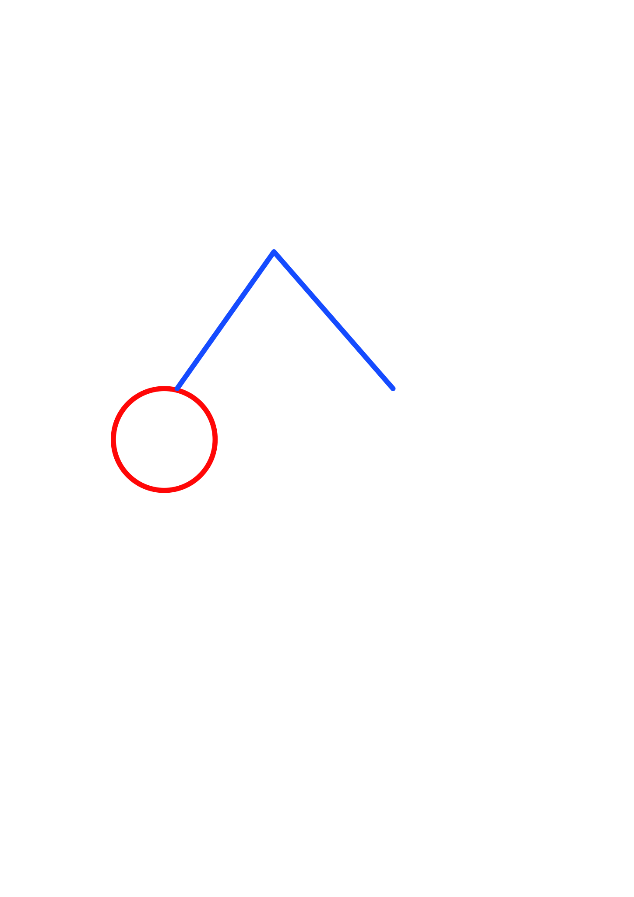

# SWD-Abschlussprojekt-Schulte-Brandt

## Installation
Um alle benötigten Pakete zu installieren muss lediglich die vorhandene requirements.txt Datei mittels pip install -r requirements.txt installiert werden.

## Ausführung
Die Anwendung kann mittels streamlit run .\UI.py ausgeführt werden. Nach dem Start gibt es mehrere Möglichkeiten zur Auswahl.

### Mechanismus erstellen
Hier können neue Mechanismen erstellt werden indem in zwei seperate Tabellen einmal die Punkte und einmal die Verbindungen zwischen den Punkten eingetragen werden. Beim Erstellen der Punkte können die Koordinaten sowie die Parameter "Statisch", "Kurbel" und "Bahnkurve" bearbeitet werden. "Statisch" dient dazu um festzulegen ob sich ein Punkt in x- und y-Richtung verschieben kann oder nicht. "Kurbel" dient dazu, festzulegen ob ein Punkt Teil der Kurbel ist. Hierbei ist auf die Definition des Kreismittelpunktes und des rotierenden Punktes zu achten. Der Kreismittelpunkt ist durch "Statisch" = True und "Kurbel" = True festgelegt, währenddessen der rotierende Punkt durch "Statisch" = False und "Kurbel" = True definiert wird. Der Parameter "Bahnkurve" bestimmt ob die Bahnkurve des ausgewählten Punktes in der Animation gezeichnet wird oder nicht. In der zweiten Tabelle können nun die Verbindungen zwischen den Punkten eingetragen werden. Wichtig ist hier, dass jede Verbindung nur einmal eingetragen wird. Durch drücken auf "Speichern" wird automatisch geprüft ob der Mechanismus valide ist. Wenn dieser Test Positiv ausfällt wird der neu erstellte Mechanismus in der Datenbank gespeichert.

### Mechanismus laden
Hier können bereits erstellte Mechanismen geladen und bearbeitet werden. Das Bearbeiten erfolgt auf die gleiche Weise wie das Erstellen eines Mechanismus. In diesem Menü sieht man außerdem eine Vorschau des Mechanismus mit allen eingetragenen Punkten und Verbindungen. Auch hier wird beim Speichern ein Test auf Validität durchgeführt und daraufhin die Daten sowie die Vorschau aktualisiert.

### Mechanismus lösen
In diesem Menü kann der ausgewählte Mechanismus durch drücken von "Mechanismus lösen" gelöst und die Bewegung animiert werden. Nach der Berechnung, welche einige Zeit in Anspruch nehmen kann, wird die Animation angezeigt und auch automatisch als GIF Datei in Ihrem Downloads Ordner gespeichert. Durch drücken von "Bahnkurve als CSV-Datei herunterladen" kann die angezeigte Bahnkurve in eine .csv Datei gespeichert werden. Wichtig ist, dass in diesem Menü der Mechanismus nicht verändert werden kann.

### SVG importieren
Hier können SVG-Dateien importiert werden, um einen neuen Mechanismus zu erstellen. Nachdem die Datei importiert wurde, können Punkte und Verbindungen noch manuell bearbeitet werden. Der Kreismittelpunkt wird durch ein Kreisobjekt definiert, und die Verbindungen durch Linienobjekte. Jeder Punkt darf im SVG maximal zwei Verbindungen besitzen, sodass eine Kette entsteht. Manuell können anschließend zusätzliche Verbindungen hinzugefügt werden. Statische und der Kurbel zugehörige Punkte müssen ebenfalls manuell eingestellt werden. Danach kann der Mechanismus gespeichert werden.

## Projekt-Dokumentation
### Umgesetzte Erweiterungen
Im Zuge dieses Projekts wurden alle in der Aufgabenstellung geforderten Grundfunktionen sowie einige Erweiterungen, welche hier kurz erläutert werden, umgesetzt. Die erste Erweiterung ist das Speichern der Animation als GIF Datei. Dies geschieht automatisch nach Berechnung der Kinematik. Des Weiteren wurde das Importieren von SVG-Dateien als alternativer Ansatz zur Erstellung von Mechanismen implementiert. Zusätzlich wurde eine Überwachung des Fehlers vom Solver in die Animation eingefügt, um die Lösung besser bewerten zu können. Die Koordinaten der Punkte für das Strandbeest Bein wurden aus [1] entnommen.

### Beispiele
#### 4-Gelenk aus SVG Importiert: SVG und GIF

    
    

#### Strandbeest Bein aus SVG Importiert: SVG und GIF

    
    

### Softwarestruktur
In Folgender Abbildung ist die grundlegende Softwarestruktur dargestellt. Die Klasse Mechanism enthält hierbei, in leicht abgewandelter Form, einige Funktionen der User Klasse [2] aus der Case Study dieses Semesters.  

### Deployte App
Die App wurde auf die Streamlit Community Cloud deployed und ist unter folgendem Link zu finden: [Streamlit-App](https://swd-abschlussprojekt-schulte-brandt-8rffwlobkyfw5ncp6qzk4a.streamlit.app/).

### Quellen
[1] Smuda, Kevin: [Strandbeest-Bein](https://www.geogebra.org/m/kzg4km9q), aufgerufen am 26.02.25.  
[2] Huber, Julian; Panny, Matthias: [users.py](https://mrp123.github.io/MCI-MECH-B-3-SWD-SWD-ILV/04_Case_Study_I/Examples/src/), aufgerufen am 26.02.25.
